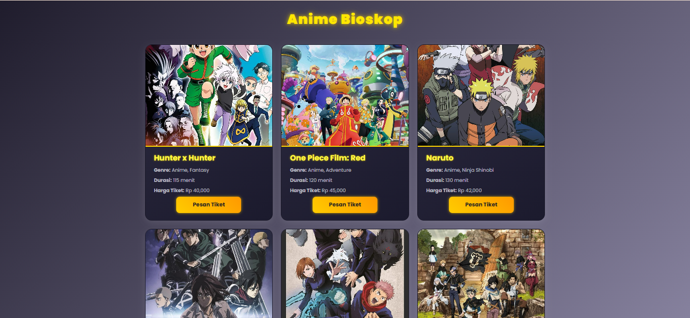
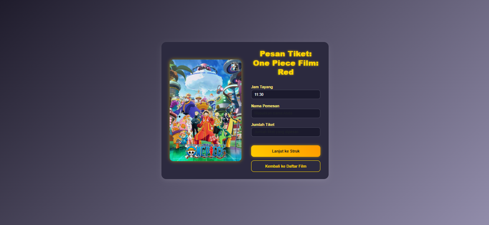
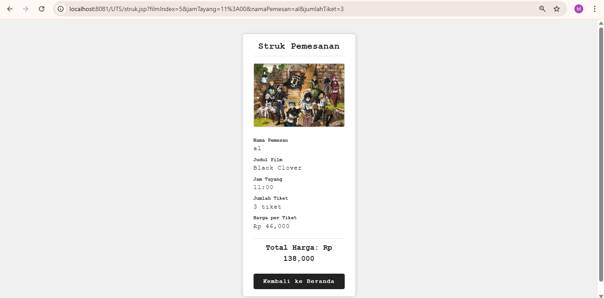

# UTS JSP - Bioskop Anime

## Deskripsi Project
Project ini adalah aplikasi pemesanan tiket bioskop sederhana berbasis JSP dan Java.  
Pengguna dapat melihat daftar film anime, memilih film, memilih jadwal tayang, memasukkan data pemesan, dan mendapatkan struk pemesanan.

## Screenshot Hasil Output

### Daftar Film  

### Form Pemesanan  

### Struk Pemesanan  

## Cara Menjalankan Aplikasi

1. Pastikan sudah install JDK dan Apache Tomcat di komputer kamu.
2. Buka project di IDE seperti NetBeans.
3. Build project.
4. Jalankan project dengan Tomcat sebagai server.
5. Buka browser dan akses `http://localhost:8080/UTS` (sesuaikan dengan nama project dan port).
6. Pilih film yang ingin dipesan, lalu isi form pemesanan dan submit.
7. Lihat struk pemesanan sebagai konfirmasi.

